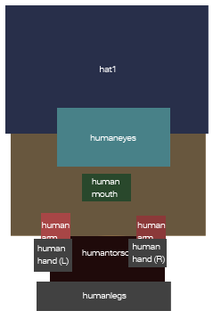
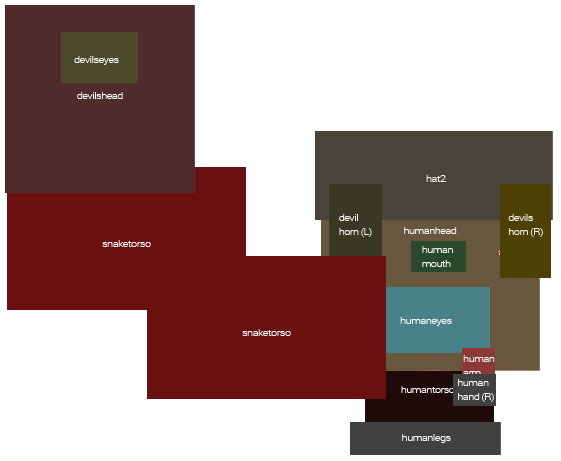

<h3 align="center">
  
</h3>

-------

Medusa
============

###### Medusa let you display a visual version of a given ontology's individual. It's supports you with a easy to use description format (JSON) for *concepts* in a declarative way. You can use it in console-only linux environments as well as in GUI mode where it can optional shows the output directly to the screen. If you want you can transfer you *concept* definition as a file or directly through std-in to it and store the output to a place in you file systems. This leads to an easy integration in a web like workflow where you can represent your ontology's individual as constructed by the user.

This project is part of conceptual blending project, see https://github.com/ConceptualBlending.

Get in contact with the developer on Twitter: [@marcus_pinnecke](https://twitter.com/marcus_pinnecke)

-------
<p align="center">
    <a href="#installation">Installation</a> &bull; 
    <a href="#quick-start">Quick Start</a> &bull; 
    <a href="#customise-input-and-repository">Customise</a> &bull; 
    <a href="#example">Example</a> &bull; 
    <a href="#development">Development</a> &bull; 
</p>
-------

# Installation
Medusa is very easy to use and doesn't not need a dedicated installation script itself. However, because it runs on .NET it is required that your machine has the .NET runtime or compatible runtime installed. The Medusa repository comes with a runable copy inside. Lets start with copying the repository to your local file system. After this you can install a .NET runtime if don't have one already. Finally you can navigate to Medusa's binary and run it.

## Step 1: Make a local copy of the repository
To get a personal copy of Medusa clone it's by typing the following inside a terminal

```
$git clone https://github.com/ConceptualBlending/monster_render_system.git
```

On Windows machines you may have to install an git system first. An alternativ way is to download the repository as zip file in the right side of this page.

Please make sure that your machine runs a .NET runtime because Medusa requires it. If you don't run Windows take a look at [Mono](http://www.mono-project.com/) which is a free port of .NET for Linux and OS X and others. 

## Step 2: Install the .NET/Mono runtime
If you are on a modern Windows machine or you have Mono already installed, you can continue with *Step 3*. 
### OS X
If you want to run Medusa on OS X just download the [Mono Package for OS X](http://www.mono-project.com/download/#download-mac) and install it. For further instructions see [Introduction to Mono on OS X](http://www.mono-project.com/docs/about-mono/supported-platforms/osx/).
### Linux
If you are on a Linux machine type the following inside a terminal

```
$ sudo apt-get install mono-complete
```

This will automatically set up you environment in order to run .NET/Mono applications.

## Step 3: Test that everything works
Navigate to the **Medusa/Binaries/Release/** inside your local copy and run
```
$ mono medusa.exe --window --no-output ../../Examples/Repository/Repository.json ../../Examples/MonsterMarkup/markup1.json
```
This will open Medusa in window mode which directly displays an individual defined inside the examples directory. The result won't be stored and get lost after you close that window. Please note that the **mono** prefix is only required if you are on a non-Windows machine running Mono.

# Quick Start
There are only two basic concepts to know if you want to use Medusa. 

A **repository** for Medusa is an index directory containing several images which are associated to *types*. Each type contains a list of points (*connection points*) with which you can express *relations* between typed *individuals*. For a set of individuals and releations between them, Medua will infer the connection points depending the individuals type and will take care to automatically arrange each individual to match your definition. 

How an individual is descripted is done with a so called **markup file**. Basically a (new) individual contains of relations between existing ones (which are also defined inside the markup file). Each of those individuals must be typed with a type inside the repository except the new one. Whereas you have to build the repository at least one time, you can build any combination of typed individuals if you want with less effort. In most use cases you will link the repository index and one markup file to the Medusa binary by typing

```
$ mono medusa.exe <path to repository index file> <path to markup input file> <path to output file>
```

# Customise Input and Repository
## Repositories

A repository is a directory containing images indexed by a repository index file. Assume the following directory content:
```
~/repository # Repository root directory
      |-- myrep.json" # Repository index file
      |-- A # Sub directory
      |   |-- a.png # Image 1
      |   |-- b.png # Image 2
      |-- B # Sub directory
      |   |-- b.png # Image 3
      |   |-- c.png # Image 4
```

The repository index file *myrep.jso* contains (relative) paths to images inside the repository as well as a unique name for each image and a list of defined connection points. Not each file inside the repository index file directory should be named here. However, if an is listed inside the repository index file, make sure the file exists. Assume creating four *types* based on *A/a.png*, *A/b.png*, *B/b.png*. Please note that a type is only identified by it's name. As you will see we take one image file twice (*A/a.png*) and have to equal images (*A/b.png*, *B/b.png*). However the following file creates four different *types*. Please ignore the (required) fields *MedusaFormatToken* and *Version* for now and use them as below. You should personalize your repository with the following properties: *RepositoryName*, *RepositoryDescription* and a list of *authors*. 

The index file content is
```
{
  "MedusaFormatToken": "REP_TYPE_FORMAT_1",
  "RepositoryContent": [
    {
      "Type": "Type1",
      "ImageFile": "A/a.png",
      "Points": {
        "Point1": {
          "x": 340,
          "y": 100
        }
      }
    },
    {
      "Type": "Type2",
      "ImageFile": "A/a.png",
      "Points": {
        "Point1": {
          "x": 140,
          "y": 200
        },
        "Point2": {
          "x": 110,
          "y": 110
        }
      }
    },
    {
      "Type": "Type3",
      "ImageFile": "A/b.png",
      "Points": {
        "Point1": {
          "x": 340,
          "y": 100
        },
        "Point2": {
          "x": 100,
          "y": 410
        }
      }
    },
    {
      "Type": "Type4",
      "ImageFile": "B/b.png",
      "Points": {
        "Point1": {
          "x": 340,
          "y": 100
        },
        "Point2": {
          "x": 100,
          "y": 410
        }
      }
    }
  ],
  "RepositoryName": "DemoRepository",
  "RepositoryDescription": "Constains art for demo",
  "Version": 1,
  "Autors": [
    {
      "Name": "Marcus Pinnecke",
      "EMail": "marcus.pinnecke@st.ovgu.de"
    }
  ]
}
```
**Important note**: Pleace take for all assets, files, references or external resources case-sensivity into account.

## Markup files
This file contains individual definitions (based on a type inside the repository) and relation definitions which conntects and move individuals. Not each type in the repository is required to use. In the following we want to create 4 individuals. Two of them are from type *Type2* whereas one is from type *Type3* and the other is *Typpe4*. Inside the definitions part we connect some connections points of those defined individuals.

The markup file content is:
```
{
  "Definitions": [
    {
      "Identifier": "i1",
      "Type": "Type2"
    },
    {
      "Identifier": "i2",
      "Type": "Type2"
    },
    {
      "Identifier": "i3",
      "Type": "Type3"
    },
    {
      "Identifier": "i4",
      "Type": "Type4"
    }
  ],
  "Relations": [
    {
      "Individual1": "i1",
      "Point1": "Point1",
      "Individual2": "i3",
      "Point2": "Point1"
    },
    {
      "Individual1": "i2",
      "Point1": "Point2",
      "Individual2": "i3",
      "Point2": "Point2"
    },
    {
      "Individual1": "i3",
      "Point1": "Point1",
      "Individual2": "i1",
      "Point2": "Point2"
    },
    {
      "Individual1": "i4",
      "Point1": "Point1",
      "Individual2": "i2",
      "Point2": "Point1"
    }
  ]
}
```
## Running Medusa with your files
It is recommanded to run medusa via terminal. Running medusa without any additional argument in the command line will open the help information which is the same as
```
$ mono medusa.exe --help
```
The general usage is as follows
```
$ mono medusa.exe [options] repositroy-file [markup-file] [output-file]
```
Please note if you set *repositroy-file*, *markup-file* and *output-file* they must be *absolute paths* or relative to the current working directory. It is not recommanded to use *~* as shortcut for your home directory. 

## General usage and command line options

The following table shows possible *option* flags.

| Short        | Long           | Description  |
| ---        | ---           | ---  |
|-h | --help | Show this help and quit|
|-e | --show-examples | Show examples and quit|
|-w | --window | Show a window containg the rendered image|
|-o | --overwrite | Allows overwriting existing output files|
| | --use-stdin | Reads the input markup file from stdin|
|-n | --no-output | Disable output file creation|

Combinations of short arguments like *-wo* are **not** supported. Please use *-w -o* instead.

Arguments:

| Name       | Required | Description  |
| ---       | --- | ---  |
| repositroy-file | Yes | Path to a .json repository file
| markup-file | Not required, iff *--use-stdin* is set | Path to a .json input file containing the markup
| output-file | Not required, iff *-w* is set | Path to a not existing file for output

**Notes**: The option -n cannot stand alone without the -w option whereas it is possible to generate an output file and display it the same time.If -n is not set you have to set the [output-file] argument. The [markup-file] is not allowed if and only if *--use-stdin* flag is set.

## Examples for Reposities and Markup Files
Medusa comes with an example repository (Medusa/Examples/Repository/Repository.json) and some markup files to play with (Examples/MonsterMarkup/*.json). 

### Use of standard input
You can put your markup directly as an input stream into Medusa instead of linking to a file. This is possible with the *--use-stdin* flag. An example call is

```
$ mono medusa.exe --use-stdin --no-output ../../Examples/Repository/Repository.json
Type :done if you finished your input or :cancel to abort.
>
```

After *>* you can type line by line you *markup file* ending with *:done*. Although it is possible to create markups on the fly with this, the standard input flag will mostly used to transfer output from another application directly to Medusa without the need of a temporary file. This is very handy when embedding Medusa inside a workflow. Suppose you have an application called *monsterman* which produces Medusa markup files based on some other input and requirements. You can transfer the output of *monsterman* to Medusa with 
```
$ monsterman | mono medusa.exe -w --use-stdin -n ../../Examples/Repository/Repository.json
```
In this example Medusa runs in window mode without any file output. Because medusa uses JSON as format you can consider to use a format converter between the output of *monsterman* and Medusa if *monsterman* produces non-Markup-files. A pseudo call with a converter tool, let's call it *convert*, between *monsterman*'s output and Medusa's input is
```
$ monsterman | convert | mono medusa.exe -w --use-stdin -n ../../Examples/Repository/Repository.json
```
# Example
This sections shows more complex examples, which are extracted from *Medusa/Examples/* inside the repository. Assume describing first a human-like individual with a typical human body and a hat then you will write something like the first markup file in this section. When you then want to switch to a similar individual wich is quite human-like but has a snake and with a tailing devils head, the second markup file shows how to do this.

First take a look at a snapshot of the repository index file, which maps types like *humantorso*, *devilshead* and so on to images inside the repository directory and specify some points.

## Repository file
```
{
  "MedusaFormatToken": "REP_TYPE_FORMAT_1",
  "RepositoryContent": [   
    {
      "Type": "humanarmleft",
      "ImageFile": "Assets/arms/humanarmleft.png",
      "Points": {
        "ToBody": {
          "x": 23,
          "y": 12
        },
        "ToHand": {
          "x": 12,
          "y": 42
        }
      }
    },
    {
      "Type": "humanarmright",
      "ImageFile": "Assets/arms/humanarmright.png",
      "Points": {
        "ToBody": {
          "x": 9,
          "y": 12
        },
        "ToHand": {
          "x": 21,
          "y": 42
        }
      }
    },
    {
      "Type": "devilseyes",
      "ImageFile": "Assets/eyes/devilseyes.png",
      "Points": {
        "ToFace": {
          "x": 37,
          "y": 27
        }
      }
    },
    {
      "Type": "humaneyes",
      "ImageFile": "Assets/eyes/humaneyes.png",
      "Points": {
        "ToFace": {
          "x": 70,
          "y": 32
        }
      }
    },
    {
      "Type": "humanhandsleft",
      "ImageFile": "Assets/hands/humanhandsleft.png",
      "Points": {
        "ToArm": {
          "x": 20,
          "y": 15
        }
      }
    },
    {
      "Type": "humanhandsright",
      "ImageFile": "Assets/hands/humanhandsright.png",
      "Points": {
        "ToArm": {
          "x": 30,
          "y": 20
        }
      }
    },
    {
      "Type": "hat1",
      "ImageFile": "Assets/hat/hat1.png",
      "Points": {
        "ToHead": {
          "x": 134,
          "y": 95
        }
      }
    },
    {
      "Type": "hat2",
      "ImageFile": "Assets/hat/hat2.png",
      "Points": {
        "ToHead": {
          "x": 130,
          "y": 106
        }
      }
    },
    {
      "Type": "devilshead",
      "ImageFile": "Assets/heads/devilshead.png",
      "Points": {
        "ToBody": {
          "x": 100,
          "y": 180
        },
        "ToHat": {
          "x": 102,
          "y": 25
        },
        "ToEyes": {
          "x": 100,
          "y": 60
        },
        "ToNose": {
          "x": 100,
          "y": 90
        },
        "ToMouth": {
          "x": 105,
          "y": 130
        }
      }
    },
    {
      "Type": "humanhead",
      "ImageFile": "Assets/heads/humanhead.png",
      "Points": {
        "ToBody": {
          "x": 130,
          "y": 197
        },
        "ToHat": {
          "x": 137,
          "y": 42
        },
        "ToEyes": {
          "x": 140,
          "y": 100
        },
        "ToEarLeft": {
          "x": 60,
          "y": 100
        },
        "ToEarRight": {
          "x": 215,
          "y": 100
        },
        "ToMouth": {
          "x": 130,
          "y": 160
        },
        "ToNose": {
          "x": 135,
          "y": 135
        }
      }
    },
    {
      "Type": "humanmouth",
      "ImageFile": "Assets/mouth/humanmouth.png",
      "Points": {
        "ToFace": {
          "x": 28,
          "y": 15
        }
      }
    },
    {
      "Type": "humanlegs",
      "ImageFile": "Assets/torso/humanlegs.png",
      "Points": {
        "ToBody": {
          "x": 79,
          "y": 3
        }
      }
    },
    {
      "Type": "humantorso",
      "ImageFile": "Assets/torso/humantorso.png",
      "Points": {
        "ToHead": {
          "x": 64,
          "y": 10
        },
        "ToArmLeft": {
          "x": 13,
          "y": 16
        },
        "ToArmRight": {
          "x": 106,
          "y": 19
        },
        "Middle": {
          "x": 54,
          "y": 39
        },
        "ToLegs": {
          "x": 61,
          "y": 84
        }
      }
    },
    {
      "Type": "snaketorso",
      "ImageFile": "Assets/torso/snaketorso.png",
      "Points": {
        "ToPart2": {
          "x": 243,
          "y": 109
        },
        "Middle": {
          "x": 160,
          "y": 70
        },
        "ToHead": {
          "x": 103,
          "y": 20
        }
      }
    }
  ],
  "RepositoryName": "DemoRepository",
  "RepositoryDescription": "Constains art to demonstrate the repository",
  "Version": 1,
  "Autors": [
    {
      "Name": "Marcus Pinnecke",
      "EMail": "email here"
    }
  ]
}
```
### One markup file
The following file (*Examples/MonsterMarkup/markup2.json*) shows how to describe a human individual and shows Medusa's output below.
```
{
  "Definitions": [
    {
      "Identifier": "torso",
      "Type": "humantorso"
    },
    {
      "Identifier": "armleft",
      "Type": "humanarmleft"
    },
    {
      "Identifier": "armright",
      "Type": "humanarmright"
    },
    {
      "Identifier": "eyes",
      "Type": "humaneyes"
    },
    {
      "Identifier": "handleft",
      "Type": "humanhandsleft"
    },
    {
      "Identifier": "handright",
      "Type": "humanhandsright"
    },
    {
      "Identifier": "hat",
      "Type": "hat1"
    },
    {
      "Identifier": "head",
      "Type": "humanhead"
    },
    {
      "Identifier": "mouth",
      "Type": "humanmouth"
    },
    {
      "Identifier": "legs",
      "Type": "humanlegs"
    }
  ],
  "Relations": [
    {
      "Individual1": "torso",
      "Point1": "ToHead",
      "Individual2": "head",
      "Point2": "ToBody"
    },
    {
      "Individual1": "head",
      "Point1": "ToHat",
      "Individual2": "hat",
      "Point2": "ToHead"
    },
    {
      "Individual1": "head",
      "Point1": "ToEyes",
      "Individual2": "eyes",
      "Point2": "ToFace"
    },
    {
      "Individual1": "head",
      "Point1": "ToMouth",
      "Individual2": "mouth",
      "Point2": "ToFace"
    },
    {
      "Individual1": "torso",
      "Point1": "ToArmLeft",
      "Individual2": "armleft",
      "Point2": "ToBody"
    },
    {
      "Individual1": "torso",
      "Point1": "ToArmRight",
      "Individual2": "armright",
      "Point2": "ToBody"
    },
    {
      "Individual1": "armleft",
      "Point1": "ToHand",
      "Individual2": "handleft",
      "Point2": "ToArm"
    },
    {
      "Individual1": "armright",
      "Point1": "ToHand",
      "Individual2": "handright",
      "Point2": "ToArm"
    },
    {
      "Individual1": "torso",
      "Point1": "ToLegs",
      "Individual2": "legs",
      "Point2": "ToBody"
    }
  ]
}
```

<h3 align="center">
  
</h3>

### Another markup file
This markup file (*Examples/MonsterMarkup/markup8.json*) shows how to describe a human-like monster with a snake as arm and a devils head connected to the snake. Medusa's output is shown below.
```
{
  "Definitions": [
    {
      "Identifier": "torso",
      "Type": "humantorso"
    },
    {
      "Identifier": "armleft",
      "Type": "snaketorso"
    },
    {
      "Identifier": "armright",
      "Type": "humanarmright"
    },
    {
      "Identifier": "eyes",
      "Type": "humaneyes"
    },
    {
      "Identifier": "handright",
      "Type": "humanhandsright"
    },
    {
      "Identifier": "hat",
      "Type": "hat2"
    },
    {
      "Identifier": "head",
      "Type": "humanhead"
    },
    {
      "Identifier": "mouth",
      "Type": "humanmouth"
    },
    {
      "Identifier": "legs",
      "Type": "humanlegs"
    },
    {
      "Identifier": "horn1",
      "Type": "devilhornleft"
    },
    {
      "Identifier": "horn2",
      "Type": "devilhornright"
    },
    {
      "Identifier": "snaketorso2",
      "Type": "snaketorso"
    },
    {
      "Identifier": "head2",
      "Type": "devilshead"
    },
    {
      "Identifier": "eyes2",
      "Type": "devilseyes"
    }
  ],
  "Relations": [
    {
      "Individual1": "torso",
      "Point1": "ToHead",
      "Individual2": "head",
      "Point2": "ToBody"
    },
    {
      "Individual1": "head",
      "Point1": "ToHat",
      "Individual2": "hat",
      "Point2": "ToHead"
    },
    {
      "Individual1": "head",
      "Point1": "ToEarLeft",
      "Individual2": "horn1",
      "Point2": "ToHead"
    },
    {
      "Individual1": "head",
      "Point1": "ToEarRight",
      "Individual2": "horn2",
      "Point2": "ToHead"
    },
    {
      "Individual1": "head",
      "Point1": "ToMouth",
      "Individual2": "eyes",
      "Point2": "ToFace"
    },
    {
      "Individual1": "head",
      "Point1": "ToEyes",
      "Individual2": "mouth",
      "Point2": "ToFace"
    },
    {
      "Individual1": "torso",
      "Point1": "ToArmLeft",
      "Individual2": "armleft",
      "Point2": "ToPart2"
    },
    {
      "Individual1": "armleft",
      "Point1": "ToHead",
      "Individual2": "snaketorso2",
      "Point2": "ToPart2"
    },
    {
      "Individual1": "snaketorso2",
      "Point1": "ToHead",
      "Individual2": "head2",
      "Point2": "ToBody"
    },
    {
      "Individual1": "head2",
      "Point1": "ToEyes",
      "Individual2": "eyes2",
      "Point2": "ToFace"
    },
    {
      "Individual1": "torso",
      "Point1": "ToArmRight",
      "Individual2": "armright",
      "Point2": "ToBody"
    },
    {
      "Individual1": "armright",
      "Point1": "ToHand",
      "Individual2": "handright",
      "Point2": "ToArm"
    },
    {
      "Individual1": "torso",
      "Point1": "ToLegs",
      "Individual2": "legs",
      "Point2": "ToBody"
    }
  ]
}
```

<h3 align="center">
  
</h3>

# Development
This section provides a brief introduction how to constribute or maintain Medusa. Medusa is written in pure C# using the standard components .NET framework. First you need a copy of the repository, which is described above. Second you need eighter .NET on Windows or Mono Development Kit (MDK). Furthermore an IDE can help you, where Visual Studio is recommended on Windows machines and MonoDevlop/Xamarin Studio is recommended for both Mac OS and Linx. 

## Setting up the environment

### Linux
The MDK is already installed, if you got Mono like above. Otherwhise type 
```
$ sudo apt-get install mono-complete
```
in your terminal. 

Using [MonoDevelop](http://www.monodevelop.com/) as development environment is recommended. If you don't have this installed already type the following into your terminal.
```
sudo apt-get install libmonogame-cil-dev monodevelop-monogame
```

### Mac OS
Using [MonoDevelop/Xamarin Studio](http://xamarin.com/) as development environment is recommended. You can download and install the packages provided by Xamarin. If you don't have the MDK installed, the package isntaller should do this automatically for you.

### Windows
This project was not tested on Windows but should be buildable with [Visual C# Express](http://www.visualstudio.com/en-us/products/visual-studio-express-vs.aspx). 

## Build Medusa

Medusa comes with a Visual Studio compatible Xamarin Studio solution file (**Medusa.sln**). Opening and building it with your IDE should work without any issues. Please note, that there is a dependency to Json.NET which you have to solve before the first bild.

### Dependencies
Medusa uses [Json.NET](http://james.newtonking.com/json) to parse Json files but does not contain these packages. Just download the latest stable version and reference the project to it. To be portable between different OS types we experienced that Json.NET built for .NET 3.5 fits best. 

## Project overview
In *Medusa/Source* you will find the entire project's source files. The next table provides a short overview about the main responsibilities:

| File                                 | Description
| ------------------------------------ | -----------------------------------------------------------------------------
| Main.cs	                             | Contains the program's entry point and argument parsing
| Core/Config.cs                       | Configuration, associated to Medusa's argument flags
| Core/GroupService.cs                 | Grouping of connected individuals in order to arrange them simultaneously
| Core/IConnectionPointDefinition.cs   | Interface for connections points
| Core/ITextureRepository.cs           | Interface for objects which devliver bitmap ressources for types
| Core/MedusaRenderer.cs               | The core component which performs the drawing
| Core/ReferencePoint.cs               | An implementation of the connection point concept
| Core/ReferencePointContainer.cs      | An list of connection points, related to a given type
| Core/Universe.cs                     | The set of all known (predefined) individuals which builds up the output
| Forms/ImageViewer.cs                 | A window to show the output directly to the user
| IO/FileSystemTextureRepository.cs    | An implementation of ITextureRepository which loads bitmaps from the file system
| IO/Repository.cs                     | The correspondending class to repository index files, serializable by Json.NET
| IO/MonsterMarkup.cs                  | The correspondending class to markup files, serializable by Json.NET
| IO/Validator.cs                      | A class which checks several constrains to markups and repositories.
| Utils/Vector2.cs                     | Simple 2D vectors

### Core Algorithm Outline
```
function buildUniverseAndDraw() : bitmap
{
   universe := empty set of (name, bitmap, list of local connection points) and relations
   result := empty bitmap
    
   foreach (relation in relations of markup file) {
      universe <- add inferInformations(Individual1 in relation);
      universe <- add inferInformations(Individual2 in relation);
      universe <- relate, group and move 
                     (relation.Individual1, *, relation.Point1) to (relation.Individual2, *, relation.Point2)) 
                     consider global positions of individual local connection points
   }
	  
   correction := vector (x,y) with calculated offset to move all object into clipping area
   result <- create clipping area with width := universe overall width, height := universe overall height
	
   forach (item in universe)
      draw item into "result" after appyling correction translation
		  
   return result
}

function inferInformations(individualName) : (name, bitmap, list of local connection points)
{
   referencePoints := empty list
   def := find definition of "individualName" in markup file
   type := find type of "def" in repository
   referencePoints := infer connections point of type related to "individualName"
   bitmap := infer image of type related to "individualName"
  
   return (individualName, bitmap, referencePoints)
}
```		

# License
This project is licensed under the terms of the GNU LESSER GENERAL PUBLIC LICENSE. See the LICENSE file.

# Contributing
1. Discuss about your idea in a new issue
2. Fork Medusa (https://github.com/ConceptualBlending/monster_render_system)
3. Create your one new feature branch (git checkout -b my-feature)
4. Commit your changes (git commit -am 'Add some feature')
5. Push to the branch (git push origin my-feature)
6. Create a new Pull Request
